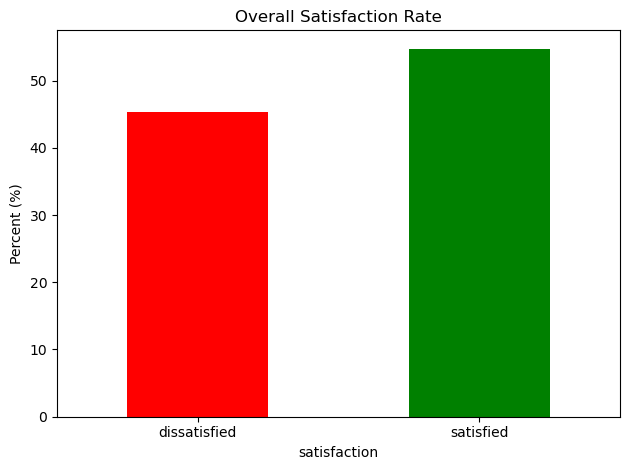
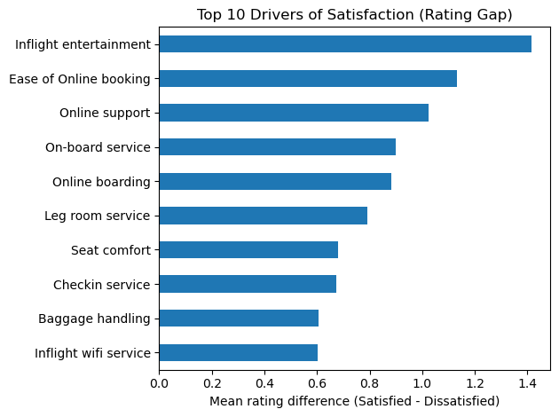
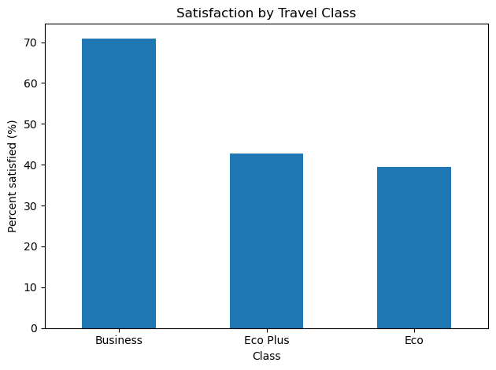
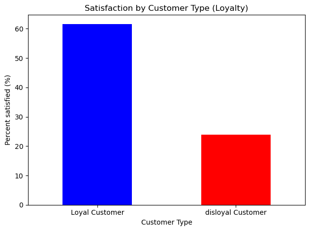

# Airline Customer Satisfaction Analysis

**Business Intelligence Analyst Portfolio Project**  
Author: Michał Król

---

## Problem Statement

The airline aims to assess its key strengths and weaknesses using passenger satisfaction survey data across different stages of the journey and evaluate their influence on overall customer satisfaction.

---

## Business Objectives

- Identify lowest-rated service areas  
- Prioritize improvements in the customer experience  
- Assess the influence of service ratings on overall satisfaction  
- Verify findings using a simple predictive model  

**Hypothesis:** Delay time has a negative impact on satisfaction rating.

---

## Data

The dataset contains customer satisfaction survey results from an undisclosed airline company.

- **Rows:** 129,880 passengers  
- **Columns:** 22 variables  
- **Rating scale:** 0–5  

Segmentation dimensions:

- Class  
- Age  
- Loyalty  
- Satisfaction  
- Type of travel  

---

## Overall Satisfaction

The dataset shows a relatively balanced distribution between satisfied and dissatisfied passengers, allowing meaningful comparison between both groups.

---

## Key Drivers of Satisfaction

The largest rating gaps between satisfied and dissatisfied passengers appear in **experience-related services**, particularly:

- Inflight entertainment  
- Ease of online booking  
- Online support  
- On-board service  
- Online boarding  

These services show the strongest influence on overall satisfaction.

---

## Satisfaction by Travel Class

Passenger satisfaction differs significantly across classes:

- **71% of premium passengers are satisfied**
- **60% of Economy passengers are dissatisfied**
- **57% of Eco Plus passengers are dissatisfied**

For Economy passengers, **seat comfort** becomes a more important driver than for premium segments.

---

## Satisfaction and Loyalty

There is a strong correlation between customer loyalty and satisfaction:

- Loyal passengers satisfied: **62%**
- Disloyal passengers satisfied: **24%**

However, correlation does not necessarily imply causation.

---

## Delay Impact

- 16% of dissatisfied passengers experienced delays longer than 30 minutes  
- 11% of satisfied passengers experienced similar delays  

This suggests that **delay has some influence but is not a primary driver of dissatisfaction**.

---

## Predictive Analysis

A **logistic regression model** was built to validate the findings.

**Model accuracy:** 82%

The model confirmed earlier insights.

### Strongest Risk Indicators

- Disloyal customers  
- Economy / Eco Plus passengers  
- Personal travel  

### Strongest Positive Indicators

- Inflight entertainment  
- On-board service  
- Seat comfort  
- Ease of online booking  

**Age turned out to be an insignificant predictor.**

---

## Final Business Interpretation

Passenger dissatisfaction is **not primarily driven by delays**.

Instead, dissatisfaction is concentrated among:

- Economy segment passengers  
- Disloyal customers  
- Medium-haul flights  
- Experience-related services (entertainment, onboard service, digital experience)

---

## Recommendations

The airline should prioritize:

- Improving **inflight entertainment and onboard experience**  
- Investing in **online booking systems and digital support**  
- Enhancing **first-time passenger experience**  
- Increasing engagement with **disloyal customers**

---

## Tools & Methodology

- **Python (Pandas, NumPy)** – data cleaning and exploratory data analysis  
- **Matplotlib / Seaborn** – data visualization  
- **Scikit-learn** – logistic regression model  
- **Jupyter Notebook** – analysis workflow  

---

## AI-Assisted Development

AI tools were used to support parts of the implementation process, including exploratory data analysis and regression model setup.

They were primarily used to accelerate code generation and explore implementation approaches.

However:

- The business problem definition and analytical direction were defined independently.
- All generated code was reviewed, tested, and adjusted where necessary.
- Full understanding of the logic behind each step was ensured before including it in the final analysis.

The regression model is treated as a **baseline validation tool**, not as a production-ready predictive system.
